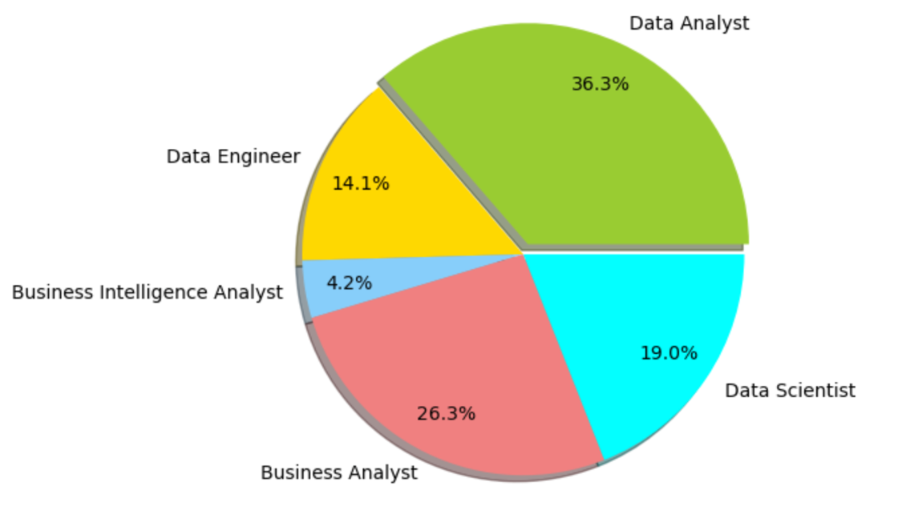
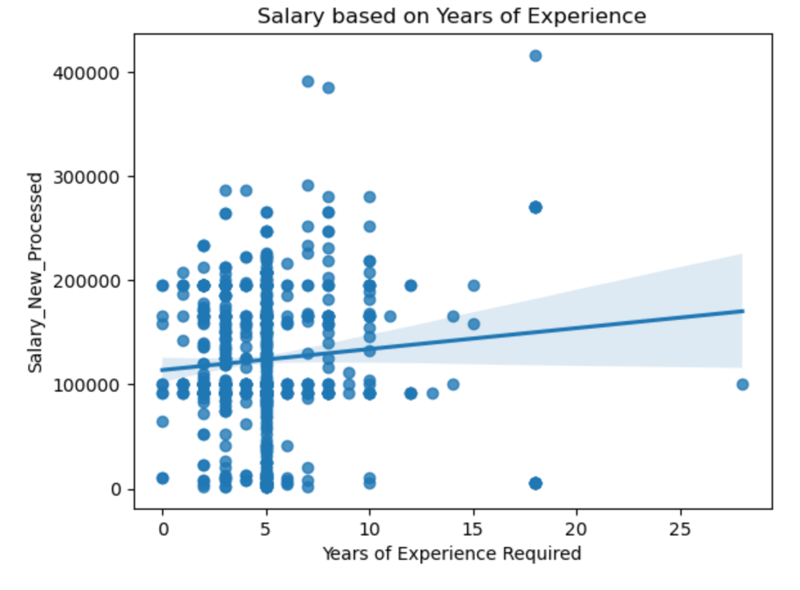
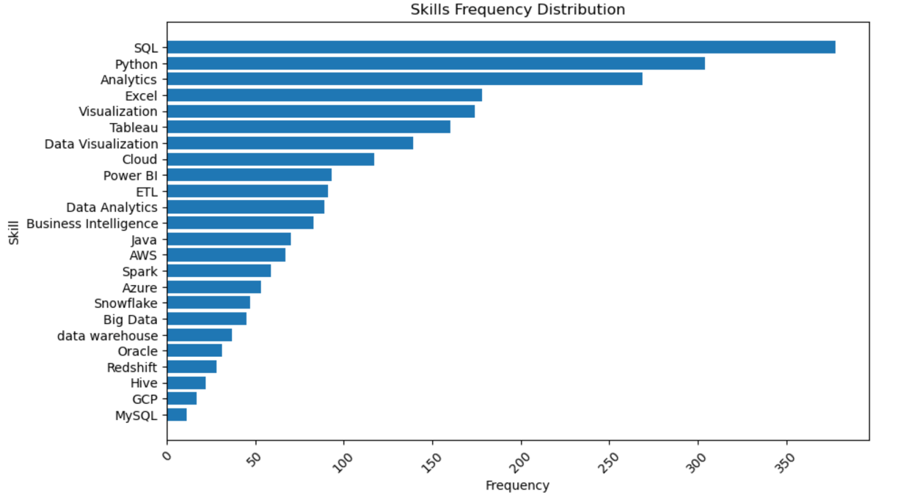

# Job Market Analysis Using Text Mining and Predictive Modeling

> Analyzing the job market and predicting salaries for data science professionals are crucial for identifying key trends, skills, and market demands. This project leverages text mining, data cleaning, and regression modeling to extract insights from job postings, offering valuable guidance for candidates and employers.

## Table of Contents

- [Overview](#overview)
- [Screenshots](#screenshots)
- [Libraries Used](#libraries-used)
- [How It Works](#how-it-works)
- [Python Files Overview](#python-files-overview)
- [Code Snippets](#code-snippets)
- [Features](#features)
- [Status](#status)
- [Challenges](#challenges)
- [Learnings](#learnings)
- [Contributors](#contributors)
- [Contact](#contact)

## Overview

This project predicts salaries for data science professionals based on their qualifications, experience, and skills. Using text mining and predictive modeling techniques, it analyzes job postings to reveal trends such as dominant job titles, required skills, and the relationship between experience and salary. Key methods include web scraping, regular expression-based cleaning, and regression models.

## Screenshots

### Key Insights and Visualizations:

1. **Job Title Variations**:
   
   - Highlights the distribution of roles like Data Analyst, Data Scientist, and Business Analyst.

2. **Salary vs. Experience**:
   
   - Displays a weak positive correlation between salary and years of experience.

3. **Skills Demand**:
   
   - SQL and Python are the most sought-after skills.

## Libraries Used

- **Python**
- **Pandas**
- **Numpy**
- **Matplotlib**
- **Seaborn**
- **Scikit-learn**

## How It Works

1. **Data Collection**: Scraped 1,222 rows and 15 columns of job-related data from various platforms.
2. **Data Cleaning**: Processed salary information, standardized job titles, and extracted skills, experience, and education levels.
3. **Feature Engineering**: Converted categorical variables into dummy variables for regression modeling.
4. **Model Training**: Employed linear regression and regression tree models to predict salaries.
5. **Visualization**: Illustrated insights through plots such as job demand, salary trends, and skill distributions.

## Python Files Overview

### Data Collection
- **GoogleLinksScrapper.ipynb**: Scrapes job links and outputs `JobLinks.csv` and `DataAnalystJobLinks.csv`.
- **Scrapper.py**: Extracts job details using the links, generating `DataAnalystJobData.csv` and `JobData.csv`.

### Data Cleaning
- **DataCleaning.ipynb**: Cleans raw scraped data from `DataAnalystJobData_scrappeddata.csv` and `JobData_scrappeddata.csv`, producing `JobData_Cleaned.csv`.

### Analysis and Visualization
- **Analysis&Visualization.ipynb**: Uses the cleaned data (`JobData_Cleaned.csv`) to perform analysis and generate visualizations.

## Code Snippets

```python
# Example: Extracting and Cleaning Salary Data
import re

def clean_salary(data):
    pattern = r'\$?\d+(?:,\d{3})*(?:\.\d+)?'
    data['Salary'] = data['Benefits'].str.extract(pattern).astype(float)
    return data

df_cleaned = clean_salary(raw_data)
```

## Features

### Current Features

- Predicts salary based on input parameters like job title, skills, and experience.
- Analyzes job market trends and skill demands.
- Visualizes data insights for better interpretation.

### Future Enhancements

- Include AI-powered prompts for personalized salary predictions.
- Expand analysis to predict trends for emerging roles.

## Status

- **Completed**: The core version is ready. Additional AI integration planned.

## Challenges

- Complex and noisy text data required extensive preprocessing.
- Extracting structured data from unstructured job descriptions was time-intensive.

## Learnings

- Mastered advanced regular expression techniques for text processing.
- Improved skills in predictive modeling and data visualization.
- Learned the importance of feature selection in regression analysis.

## Contributors

- **Varshitha Pereddy**
- **Divya Bhavani Veligandla**
- **Puja Gundu**
- **Osheen Gupta**
- **Komal Nayak**
- **Vibha Gupta**
- **Pavan Vinay Veesam**

## Contact

Feel free to connect for collaboration or queries.

- **Email**: [osheengupta1994@gmail.com](mailto:osheengupta1994@gmail.com)
- **GitHub**: [osheengupta](https://github.com/osheengupta)
- **LinkedIn**: [Osheen Gupta](https://linkedin.com/in/osheengupta/)
